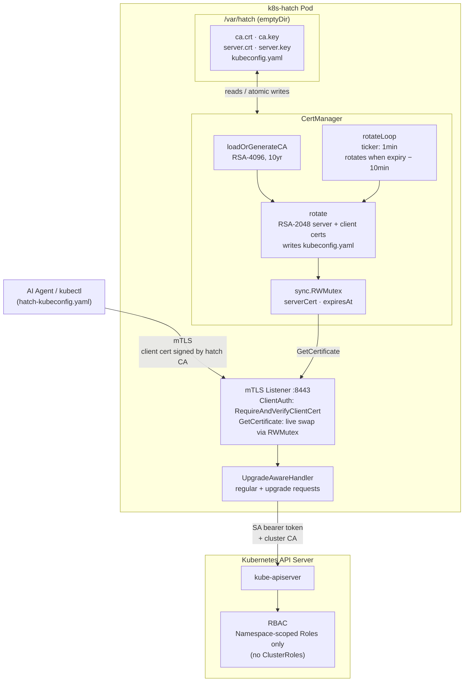
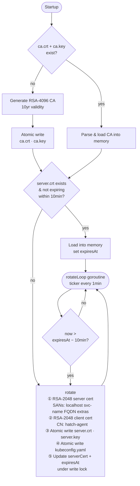
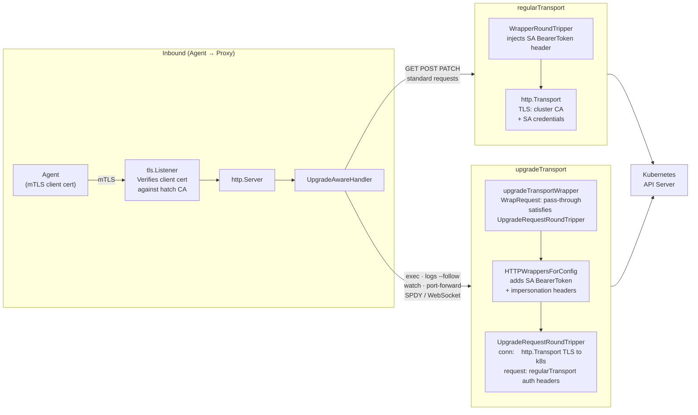
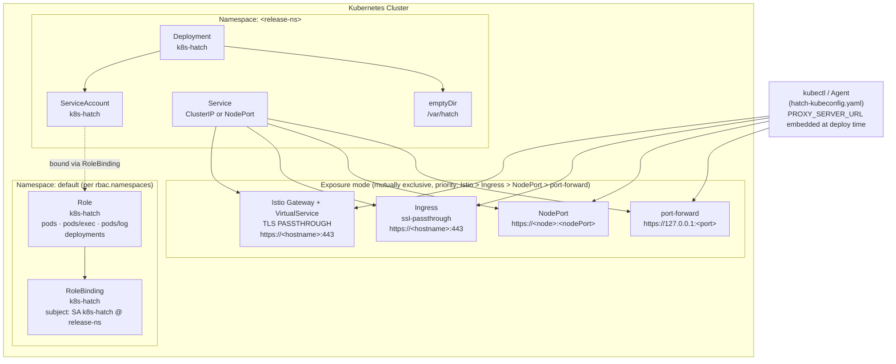

# k8s-hatch Architecture

## System Overview

```mermaid
graph TB
    Agent["AI Agent / kubectl\n(hatch-kubeconfig.yaml)"]

    subgraph pod["k8s-hatch Pod"]
        subgraph emptydir["/var/hatch (emptyDir)"]
            files["ca.crt · ca.key\nserver.crt · server.key\nkubeconfig.yaml"]
        end

        subgraph cm["CertManager"]
            genCA["loadOrGenerateCA\nRSA-4096, 10yr"]
            rotate["rotate\nRSA-2048 server + client certs\nwrites kubeconfig.yaml"]
            loop["rotateLoop\nticker: 1min\nrotates when expiry − 10min"]
            lock["sync.RWMutex\nserverCert · expiresAt"]
        end

        listener["mTLS Listener :8443\nClientAuth: RequireAndVerifyClientCert\nGetCertificate: live swap via RWMutex"]
        handler["UpgradeAwareHandler\nregular + upgrade requests"]
    end

    subgraph k8s["Kubernetes API Server"]
        apiserver["kube-apiserver"]
        rbac["RBAC\nNamespace-scoped Roles only\n(no ClusterRoles)"]
    end

    Agent -->|"mTLS\nclient cert signed by hatch CA"| listener
    files <-->|reads / atomic writes| cm
    genCA --> rotate
    rotate --> lock
    loop --> rotate
    lock -->|GetCertificate| listener
    listener --> handler
    handler -->|"SA bearer token\n+ cluster CA"| apiserver
    apiserver --> rbac
```

---

## Cert Lifecycle

```mermaid
flowchart TD
    Start([Startup])

    Start --> loadCA{ca.crt + ca.key\nexist?}
    loadCA -->|yes| parseCA[Parse & load CA into memory]
    loadCA -->|no| genCA[Generate RSA-4096 CA\n10yr validity]
    genCA --> writeCA[Atomic write\nca.crt · ca.key]
    writeCA --> loadCerts
    parseCA --> loadCerts

    loadCerts{server.crt exists\n& not expiring\nwithin 10min?}
    loadCerts -->|yes| loadMem[Load into memory\nset expiresAt]
    loadCerts -->|no| rotate

    rotate[rotate\n① RSA-2048 server cert\n   SANs: localhost svc-name FQDN extras\n② RSA-2048 client cert\n   CN: hatch-agent\n③ Atomic write server.crt · server.key\n④ Atomic write kubeconfig.yaml\n⑤ Update serverCert + expiresAt\n   under write lock]

    loadMem --> loop
    rotate --> loop

    loop([rotateLoop goroutine\nticker every 1min])
    loop --> check{now >\nexpiresAt − 10min?}
    check -->|no| loop
    check -->|yes| rotate
```

---

## Transport Layering

```mermaid
graph LR
    subgraph inbound["Inbound  (Agent → Proxy)"]
        agent["Agent\n(mTLS client cert)"]
        tlsln["tls.Listener\nVerifies client cert\nagainst hatch CA"]
        httpsrv["http.Server"]
        uah["UpgradeAwareHandler"]
    end

    subgraph regular["regularTransport"]
        direction TB
        wrap["WrapperRoundTripper\ninjects SA BearerToken header"]
        httpt["http.Transport\nTLS: cluster CA\n+ SA credentials"]
        wrap --> httpt
    end

    subgraph upgrade["upgradeTransport"]
        direction TB
        utw["upgradeTransportWrapper\nWrapRequest: pass-through\nsatisfies UpgradeRequestRoundTripper"]
        httpw["HTTPWrappersForConfig\nadds SA BearerToken\n+ impersonation headers"]
        urt["UpgradeRequestRoundTripper\nconn:    http.Transport TLS to k8s\nrequest: regularTransport auth headers"]
        utw --> httpw --> urt
    end

    k8s["Kubernetes\nAPI Server"]

    agent -->|"mTLS"| tlsln --> httpsrv --> uah
    uah -->|"GET POST PATCH\nstandard requests"| regular --> k8s
    uah -->|"exec · logs --follow\nwatch · port-forward\nSPDY / WebSocket"| upgrade --> k8s
```

---

## Helm Deployment Topology

```mermaid
graph TB
    subgraph cluster["Kubernetes Cluster"]
        subgraph release["Namespace: &lt;release-ns&gt;"]
            sa["ServiceAccount\nk8s-hatch"]
            deploy["Deployment\nk8s-hatch"]
            svc["Service\nClusterIP or NodePort"]
            vol["emptyDir\n/var/hatch"]
            deploy --> vol
            deploy --> sa
        end

        subgraph target["Namespace: default  (per rbac.namespaces)"]
            role["Role\nk8s-hatch\npods · pods/exec · pods/log\ndeployments"]
            rb["RoleBinding\nk8s-hatch\nsubject: SA k8s-hatch @ release-ns"]
            role --> rb
        end

        sa -.->|bound via RoleBinding| role

        subgraph expose["Exposure mode (mutually exclusive, priority: Istio > Ingress > NodePort > port-forward)"]
            pf["port-forward\nhttps://127.0.0.1:&lt;port&gt;"]
            np["NodePort\nhttps://&lt;node&gt;:&lt;nodePort&gt;"]
            ing["Ingress\nssl-passthrough\nhttps://&lt;hostname&gt;:443"]
            gw["Istio Gateway + VirtualService\nTLS PASSTHROUGH\nhttps://&lt;hostname&gt;:443"]
        end

        svc --> pf & np & ing & gw
    end

    client["kubectl / Agent\n(hatch-kubeconfig.yaml)\nPROXY_SERVER_URL embedded at deploy time"]
    client --> pf & np & ing & gw
```
